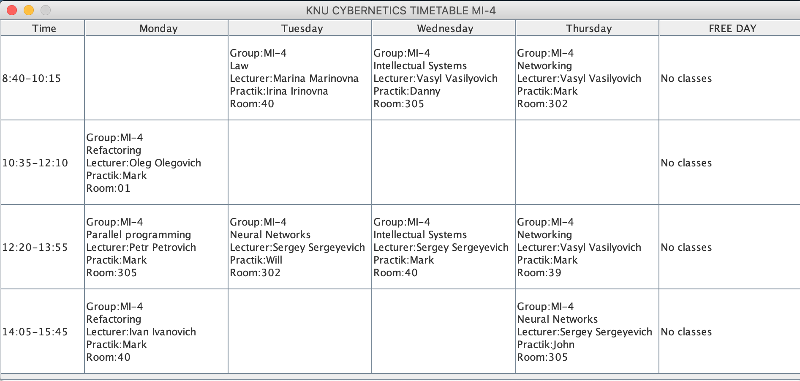
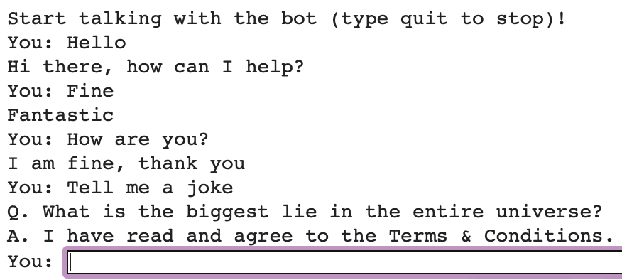
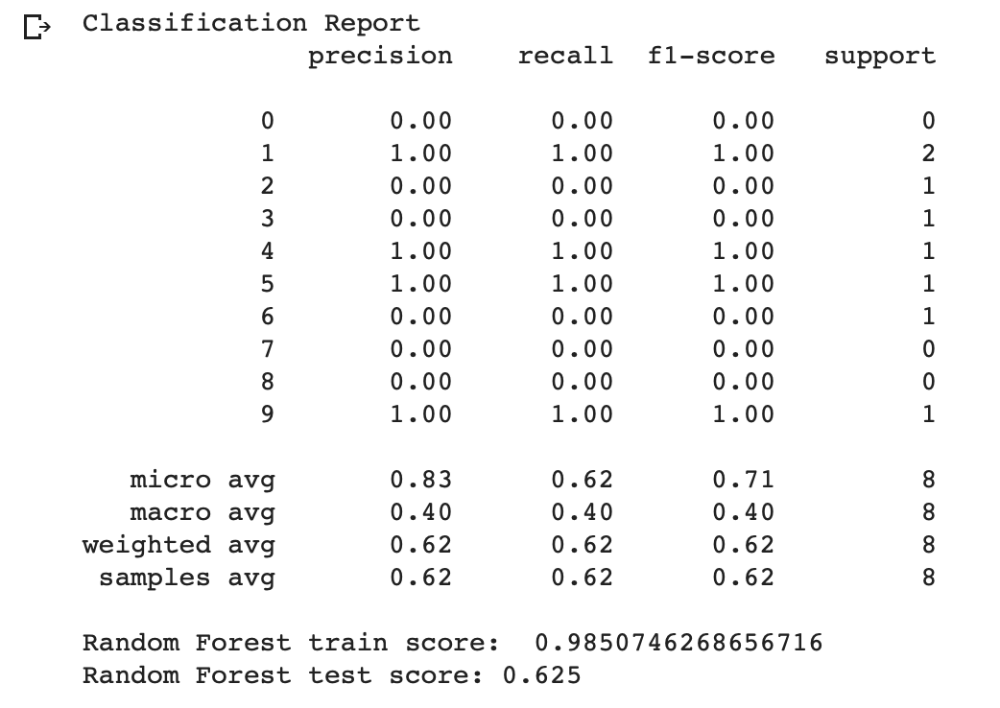

# intellectual-system-labs

В папке pacman-rip-off/ - финальная версия лабораторной про пакмана. Так же файл Report.pdf - отчёт на лабораторную - была выполнена в команде с Франчуком и Трескуновым. 

 ___________________________________________________________________________________

4я лабораторная в timetable/, написана на java. Составление расписания используя генетический алгоритм.
В классе Main агрессивно (капсом) прописаны комментарии в местах для кастомизации экспириенса.
(Составление расписания для группы МИ-4, по примеру реального расписания, пятница - день самоподготовки.)

Пример выполнения:

 ___________________________________________________________________________________
 

В папке fDialog 1я лабораторная - чат-бот, работает на RandomForest🌲🌲🌲.

Пример выполнения:

Точность:

 ___________________________________________________________________________________
 
 
